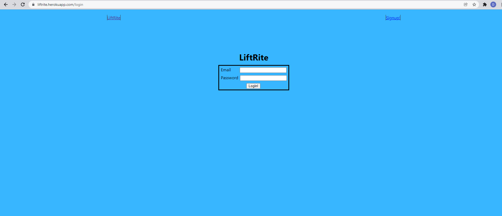
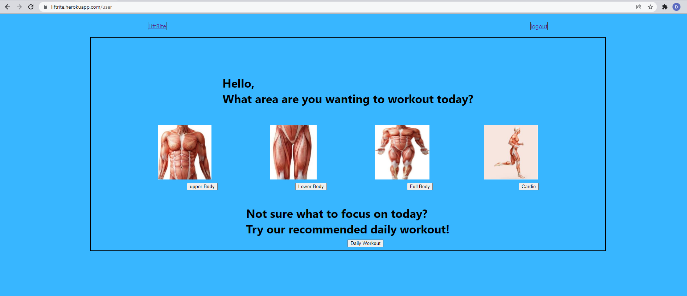
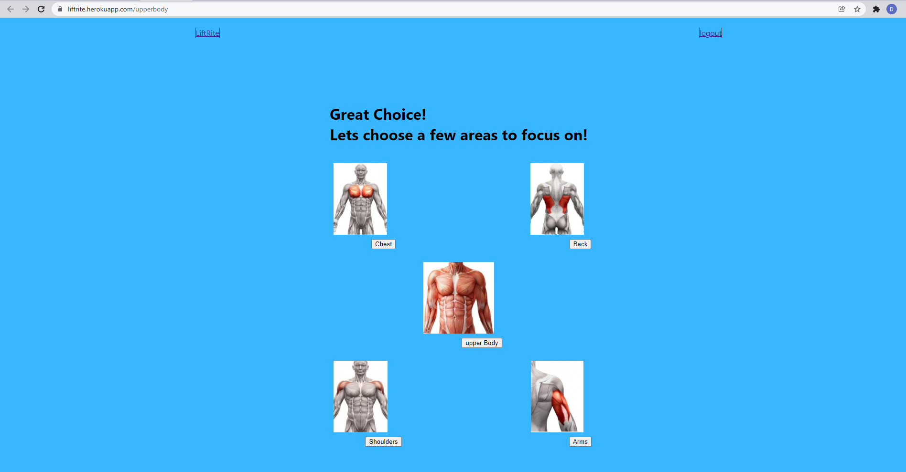

# LiftRite

A intuitive workout webpage app that helps the user to select what areas of the body they would like to workout. This app will allow the user to select which muscles within that area of the body they selected to workout to focus on, and even post workout exercise suggestions. The user will be able to select the workout and add it to a workout list for the day and save the workout for quick and easy workout plans. 

## User Story 

As a workout enthusiast, it is important that we are aware of the different muscle groups to which we are trying to target for the day. Any new comer to the gym struggles to find workout programs and lists that allow them to target just the muscles they want to focus on. This webpage app looks to solve all these problems by allowing the user to see viaully what muscles are targetted as well as a small demonstration to each workout variable, which will save the user time, and increase metabolic efficacy and time efficiency. 

## Mock-up 

SplashScreen

/login allows user to access login screen 

After login user site redirects to user profile

After selecting what section of the body you want to workout, user is redirected to a subgroup of the section of muscles. 

## Links 

[Link to the Code Repository](https://github.com/DexterLGriffith/FinalProject)

[Link to the deployed Heroku app](https://liftrite.herokuapp.com/)

## Credits 

Dexter Griffith

Prince Ndebele

## Libraries and frameworks 

[Logo Design: Canva](https://www.canva.com/)

[React-Bootstrap: Components, buttons and navbar](https://react-bootstrap.github.io/components/buttons/)